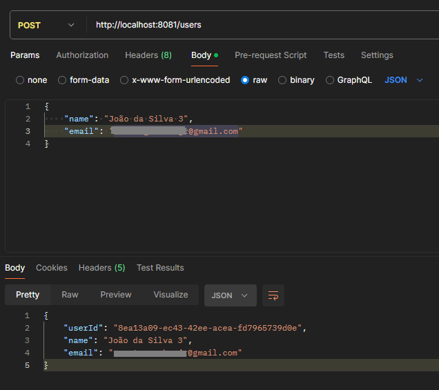
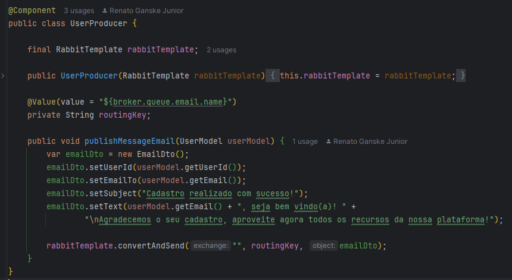
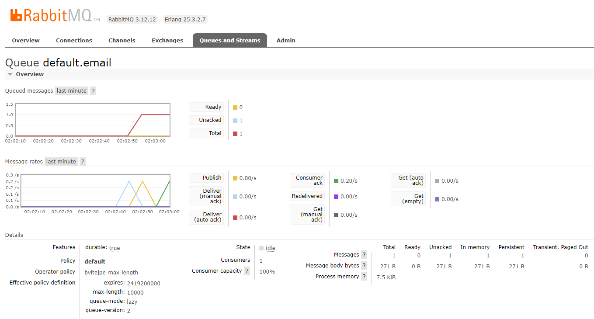
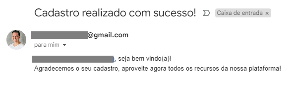

# Microsserviço de Cadastro e Envio de Email
Este projeto consiste em dois microsserviços: um para cadastro de usuários e outro para envio de emails, utilizando mensageria com RabbitMQ.

## Estrutura do Projeto
O projeto é dividido em duas aplicações separadas: user e email.

### user
Este microsserviço é responsável por criar o cadastro de um novo usuário, salvá-lo no banco e criar um email dando boas-vindas ao novo usuário cadastrado.
Para isso, o usuário informa um nome e um email. A classe UserProducer é responsável por, com base nas informações de cadastro, criar o e-mail e enviá-lo para a fila do RabbitMQ.

###### Requisição criando o usuário

###### Classe UserProducer

###### Tela do RabbitMQ Demonstrando a Movimentação

 

### email
Este microsserviço é responsável por receber as mensagens da fila RabbitMQ e enviar emails aos usuários.
Para o envio, foi usado o próprio gmail, de movo que as variáveis de ambiente foram configuradas localmente.

Email recebido após a mensagem ser consumida pelo serviço de email

## Tecnologias Utilizadas
Java 17
Spring Boot
Spring Data JPA
RabbitMQ
Spring AMQP
Spring Mail
PostgreSQL